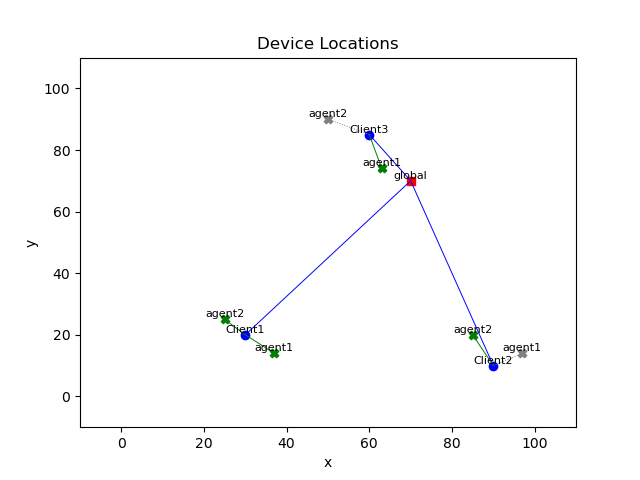
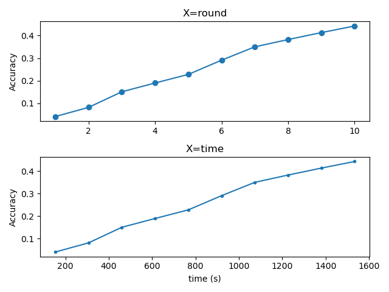

# Federated_Learning_Simulator_with_LA_Multipath
## About The Project
이 프로젝트는 연합 학습과 다중 경로 통신을 결합하여 학습 성능을 향상시키는 것을 목표로 한다. 주변 기기로 명명된 Learning Agent를 도입하여 클라이언트보다 성능이 우수한 기기에서 학습을 진행하고, 다중 경로 통신을 통해 모델을 효율적으로 분산 전송한다. 자세한 내용은 논문 `Learning agent 활용 및 다중 경로 기반 모델 분할 전송을 통한 연합학습 개선`에서 확인할 수 있다. 
### Key Features
- Learning Agent: 클라이언트가 신뢰할 수 있는 주변 기기로 클라이언트 대신 학습을 진행하여 학습 성능을 향상할 수 있음
- Multipaths: 기존의 단일 경로 통신이 아닌 다중 경로 통신을 활용하여 모델을 효율적으로 분산 전송
## Overview
본 시뮬레이터는 Learning agent와 다중경로 모두 사용하지 않는 경우부터 모두 사용하는 경우까지의 4가지 상황에 대한 연합학습을 시뮬레이션 할 수 있다. 
## Requirements
Python 3.9 version  
use `requirements.txt`
## Project Files Description 
1. python file
   - `device.py`
     - server, client, learning agent의 성능, 통신방법, 데이터셋 등을 선언
   - `Record.py`
      - 사용한 기기의 성능 기록을 위한 객체 선언 
   - `helper.py`
      - Simulator.py에 사용하는 함수 정의
   - `Simulator.py`
      - 가상 기기 생성 및 시뮬레이션 함수 정의
   - `main.py`
      - 연합학습 Simulator 실행
2. yaml
   - 사용자의 상황에 맞는 값을 추가하여 활용 가능
   - `communication.yaml`
     - 서버, 클라이언트, Learning Agent에서 사용할 수 있는 통신 수단 실측값
     - 5G, LTE, WIFI, Ethernet 1Gbps, Ethernet 500Mbps
   - `model.yaml`
      - 글로벌모델로 사용할 수 있는 모델의 크기
      - MobileNet V2, Inception V3, U-Net, SRGAN
   - `device.yaml`
      - model.yaml에 입력된 글로벌모델에 해당하는 클라이언트와 Learning Agent의 학습 성능
      - GPU(Desktop/Laptop), SoC(SmartPhone/Tablet)
   - `dataset.yaml`
      - 로컬학습에 사용되는 데이터셋
      - MNIST, CIFAR10, CelebA
   - `path_setting.yaml`
     - output 주소 설정
     ```
     root_path: "./output_basic/"
     multi:
        with_la: "./output_basic/multipaths/with_la/"
        without_la: "./output_basic/multipaths/without_la/"
     single:
        with_la: "./output_basic/singlepath/with_la/"
        without_la: "./output_basic/singlepath/without_la/"
     ```
   - `custom_setting.yaml`
      - 구조는 아래와 같다.
     ```
     setting:
        min_acc:       # minimum accuracy  
        max_acc:       # maximum accuracy  
        w_of_epoch:    # weight of local training epoch  
        w_of_client:   # weight of participated client  
        round_num:     # 진행 round 수  
        edge_num:      # client 개수  
        model:         # 사용하는 모델  

      server_spec:
         communication_1:         # server가 사용하는 통신방법1
         communication_2:         # server가 사용하는 통신방법2
         location:                # server 위치
            x: 
            y: 
     
      edge_device_spec:
         client_spec:
            location:             # client 위치
               x: 
               y: 
               device:            # client의 기기 설정 
            communication_1:      # client가 사용하는 통신방법1
            communication_2:      # client가 사용하는 통신방법2
            dataset:              # client의 데이터셋
            agent_num:            # client가 가지는 learning agent 개수
     
            agent_spec:
               location:         # learning agent의 위치
                  x: 
                  y:
               device:           # learning agent의 기기 설정
               communication_1:  # learning agent가 사용하는 통신 방법1
               communication_2:  # learning agent가 사용하는 통신 방법2
     ```
## Run
1. Single path
   ```
   python main.py
   ```
2. Multi paths
   ```
   python main.py --use_multipaths
   ```
## Results
### 1. Configuration situation
 - `Device_spec.csv`
 - `Device_Location.png`
 
   
### 2. output
```
output_basic
├─multipaths
│  ├─ Roundtime Comparison.png
│  ├─without_la
│  │  ├─ output_without_la.csv
│  │  ├─ accuracy_Graph_without_la.png
│  │  └─used_node
│  │     └─ animation_without_la.gif
│  └─with_la
│     ├─ output_with_la.csv
│     ├─ accuracy_Graph_with_la.png
│     └─used_node
│        └─ animation_with_la.gif
└─singlepath
    ├─ Roundtime Comparison.png
    ├─without_la
    │  ├─ output_without_la.csv
    │  ├─ accuracy_Graph_without_la.png
    │  └─used_node
    │     └─ animation_without_la.gif
    └─with_la
        ├─ output_with_la.csv
        ├─ accuracy_Graph_with_la.png
        └─used_node
          └─ animation_with_la.gif
```
- `output_(with_la or without_la).csv`
- `accuracy_Graph_(with_la or without_la).png`

  
- `animation_(with_la or without_la).gif`
     
  
- `Roundtime comparision.png`

  
