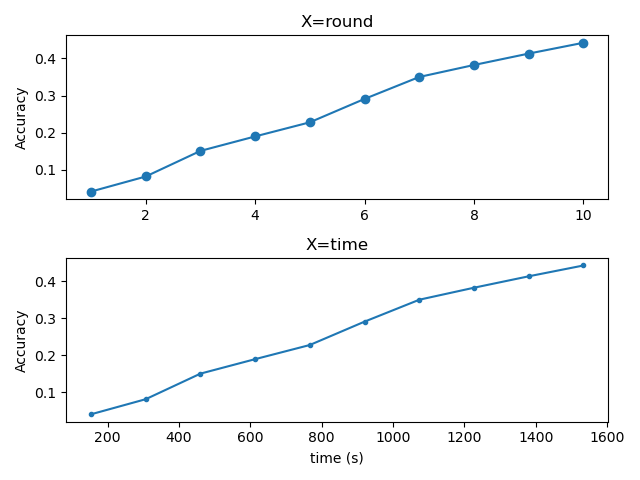

# Federated_Learning_Simulator_with_LA_Multipath
## About The Project
This project aims to enhance learning performance by combining federated learning and multi-path communication.
By introducing nearby devices named after Learning agents, learning is performed in a device that performs better than a client, and the model is efficiently distributed and transmitted through multi-path communication.
You can find detailed information in the paper `Improvement of Federated Learning using Learning Agent and Multipath-based Model Split Transmission`. 
### Key Features
- Learning Agent: client-trusted nearby devices. Learn instead of clients to improve learning performance
- Multipaths: Efficient distributed transmission of models using multi-path communication rather than single-path communication
## Overview
This simulator can simulate federated learning for four scenarios from the case of not using both the learning agent and the multipath to the case of using all of them.
## Requirements
Python 3.9 version  
use `requirements.txt`
## Project Files Description 
1. python file
   - `device.py`
     - Define Server, Client, Learning agent's performance, communication, dataset, etc
   - `Record.py`
      - Declaration of an object for recording the performance of the utilized devices. 
   - `helper.py`
      - Define functions used for Simulator.py
   - `Simulator.py`
      - Definition of Simulation Functions and creating virtual devices
   - `main.py`
      - Run Federated Learning Simulator
2. yaml
   - Can be utilized by adding value that fits the user's situation
   - `communication.yaml`
     - Communication actual measurements value of Server,Client,Learning Agent
     - 5G, LTE, WIFI, Ethernet 1Gbps, Ethernet 500Mbps
   - `model.yaml`
      - Size of model available as a global model
      - MobileNet V2, Inception V3, U-Net, SRGAN
   - `device.yaml`
      - Learning performance of Clients and Learning agents corresponding to the model entered in model.yaml
      - GPU(Desktop/Laptop), SoC(SmartPhone/Tablet)
   - `dataset.yaml`
      - Datasets used for local training
      - MNIST, CIFAR10, CelebA
   - `path_setting.yaml`
     - set paths of outputs
     ```
     root_path: "./output_basic/"
     multi:
        with_la: "./output_basic/multipaths/with_la/"
        without_la: "./output_basic/multipaths/without_la/"
     single:
        with_la: "./output_basic/singlepath/with_la/"
        without_la: "./output_basic/singlepath/without_la/"
     ```
   - `custom_setting.yaml`
      - The structure is as follows.
     ```
     setting:
        min_acc:       # minimum accuracy  
        max_acc:       # maximum accuracy  
        w_of_epoch:    # weight of local training epoch  
        w_of_client:   # weight of participated client  
        round_num:     # number of rounds
        edge_num:      # number of clients  
        model:         # the model being used  

      server_spec:
         communication_1:         # the communication method used by the server: Method 1
         communication_2:         # the communication method used by the server: Method 2
         location:                # location of the server
            x: 
            y: 
     
      edge_device_spec:
         client_spec:
            location:             # location of the client
               x: 
               y: 
               device:            # setting up the client's device 
            communication_1:      # the communication method used by the client: Method 1
            communication_2:      # the communication method used by the client: Method 2
            dataset:              # dataset of the client
            agent_num:            # number of learning agents connected to the client
     
            agent_spec:
               location:         # location of the learning agent
                  x: 
                  y:
               device:           # setting up the learning agent's device
               communication_1:  # the communication method used by the learning agent: Method 1
               communication_2:  # the communication method used by the learning agent: Method 2
     ```
## Run
1. Single path
   ```
   python main.py
   ```
2. Multi paths
   ```
   python main.py --use_multipaths
   ```
## Results
### 1. Configuration situation
 - `Device_spec.csv`
 - `Device_Location.png`
 
   
### 2. output
```
output_basic
├─multipaths
│  ├─ Roundtime Comparison.png
│  ├─without_la
│  │  ├─ output_without_la.csv
│  │  ├─ accuracy_Graph_without_la.png
│  │  └─used_node
│  │     └─ animation_without_la.gif
│  └─with_la
│     ├─ output_with_la.csv
│     ├─ accuracy_Graph_with_la.png
│     └─used_node
│        └─ animation_with_la.gif
└─singlepath
    ├─ Roundtime Comparison.png
    ├─without_la
    │  ├─ output_without_la.csv
    │  ├─ accuracy_Graph_without_la.png
    │  └─used_node
    │     └─ animation_without_la.gif
    └─with_la
        ├─ output_with_la.csv
        ├─ accuracy_Graph_with_la.png
        └─used_node
          └─ animation_with_la.gif
```
- `accuracy_Graph_with_la.png`

  
- `animation_with_la.gif`
     
  
- `Roundtime comparision.png`

  
